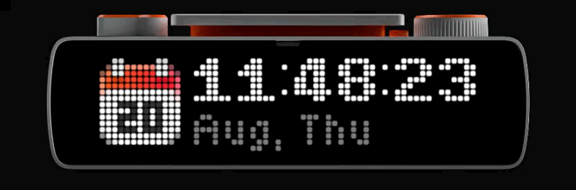
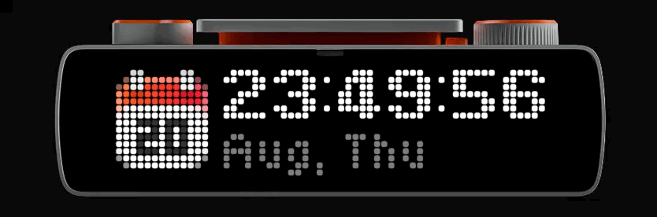

# Deploy Barometer

The infamous [shouldideploy.today](https://shouldideploy.today) displayed on a
[BUSY Bar](https://busy.app) — in colour, fitted to the panel, with an 8-bit sound.

Call one endpoint and the bar floods **green** or **red**, fits the whole verdict
onto its 72×16 LED matrix, and plays a chiptune fanfare or a buzz. Press the
physical **start/pause** button and it pulls the next quip from the API.

<p align="center">
  
  <br>
  <em>A green day — the whole verdict fitted to the panel.</em>
</p>

<!--
  Second recording, showing a red "do not deploy" verdict. Drop the file in as
  docs/assets/false.gif, then delete this comment's opening and closing markers
  to publish the block below.

<p align="center">
  
  <br>
  <em>A red day — same fitting, opposite answer.</em>
</p>
-->

---

## Guide for new users

### 1. What you need

- A BUSY Bar, reachable over USB or Wi-Fi.
- Docker (recommended), or Python 3.11+.
- The bar's API PIN, if it has one set.

### 2. Find your bar and its PIN

Plugged in over USB, a BUSY Bar is **always** at `10.0.4.20`. Over Wi-Fi, try
`busybar.local` or the IP shown in the bar's network settings.

Check whether it wants a PIN:

```bash
curl http://10.0.4.20/api/access
# {"mode":"key","key_valid":true}   -> a PIN is required
# {"mode":"enabled"}                -> no PIN needed
```

`mode` comes from the bar's own settings. If it is `disabled`, turn the HTTP API
on first, or nothing here will reach it.

### 3. Configure

```bash
git clone <this repo> && cd deploy-barometer
cp .env.example .env
```

Edit `.env` and set at least your PIN:

```ini
BAROMETER_BUSYBAR_HOST=10.0.4.20
BAROMETER_BUSYBAR_TOKEN=123456
BAROMETER_TIMEZONE=Europe/Berlin
```

`.env` is gitignored, so your PIN stays out of version control.

### 4. Run it

**With Docker (recommended):**

```bash
docker compose up -d
```

**Or directly:**

```bash
pyenv virtualenv 3.14 3.14-deploy-barometer
pyenv activate 3.14-deploy-barometer
pip install -e .
deploy-barometer          # run from the repo root, so .env is found
```

Either way it listens on **port 2323**, bound to `0.0.0.0` — so it answers on
localhost *and* on your machine's LAN IP.

### 5. Trigger it

```bash
curl -X POST localhost:2323/check
```

Or from your phone, or anything else on your network:

```bash
curl -X POST http://192.168.1.50:2323/check     # your laptop's LAN IP
```

`GET` works too, so a plain `curl`, a browser bookmark, or a webhook that only
does `GET` is enough — no `-X POST` needed:

```bash
curl deploy-barometer.local:2323/check
```

That name is published over mDNS, so the API answers to **three** addresses:

| Address | Works from |
| --- | --- |
| `localhost:2323` | this machine |
| `192.168.1.50:2323` | anything on your network |
| `deploy-barometer.local:2323` | anything on your network, no IP to remember |

See [Name on the network](#name-on-the-network) if you are running in Docker.

The bar lights up, and you get back exactly what it displayed:

```json
{
  "should_deploy": true,
  "message": "Go for it",
  "timezone": "Europe/Berlin",
  "source": "api",
  "display": {
    "text": "Go for it",
    "font": "extra_large",
    "mode": "fit",
    "presentation": "static",
    "lines": ["Go for it"],
    "background": "#00B000FF",
    "sound": "go.snd"
  }
}
```

Now **press the start/pause button on the bar** — it fetches the next message
and re-renders. The API serves a random quip each time.

---

## The endpoints

Two, as promised.

| Method | Path | Purpose |
| --- | --- | --- |
| `GET` or `POST` | `/check` | Fetch the current verdict and show it on the bar. |
| `GET` | `/health` | Is the app up, and is the bar reachable? |

`/check` answers `502` if either shouldideploy.today or the bar cannot be
reached, with the reason in `detail`.

`/health` answers `200` when the bar responds and `503` when it does not, and
includes the last thing displayed:

```json
{
  "status": "ok",
  "device": {"reachable": true, "host": "10.0.4.20", "firmware": "1.1.1", "battery_charge": 99},
  "last_reading": { "...": "..." }
}
```

---

## Display modes

Set `BAROMETER_DISPLAY_MODE` to choose how a message that does not fit on one
line is handled.

### `fit` (default) — everything on screen at once

The whole message is always readable without waiting.

1. If it fits on one line, it uses the **largest font it fits in** — up to
   `extra_large`, which fills the panel.
2. Otherwise it wraps onto **up to three lines** of the smallest font.
3. Only if it is *still* too tall does it scroll, and then it scrolls
   **downwards**: the first three lines are held still, with `...` marking that
   there is more below, for `BAROMETER_READ_PAUSE_SECONDS` (3s by default). Then
   it walks down a pixel at a time to reveal the rest, pauses, and loops.

In practice almost every message fits without scrolling at all — of a sample of
the API's quips, all but the longest sat on screen whole.

### `scroll` — one line, sideways

Keeps the message on a single line in a large font and lets the firmware
marquee it sideways. Set `BAROMETER_DISPLAY_MODE=scroll`.

---

## How it works

### The verdict

[shouldideploy.today](https://shouldideploy.today) answers with a boolean and a
random quip:

```json
{"timezone":"Europe/Berlin","date":"...","shouldideploy":false,"message":"Tomorrow?"}
```

There is no third state — it is yes or no — so there are exactly two colours and
two sounds. The message is re-rolled on every call, which is what makes pressing
the button again worthwhile.

### Fitting text to a 72×16 panel

This is the fiddly part. The firmware's fonts are proportional bitmaps with no
metrics endpoint, so the widths were **measured on the device itself**.

`scripts/calibrate_fonts.py` draws every printable ASCII glyph on the panel,
reads the framebuffer back, and records each glyph's true advance width into
[`src/barometer/font_metrics.json`](src/barometer/font_metrics.json). Glyphs are
laid out with a 1px gap that is not drawn after the last one, so:

```
width(s) = Σ advance(c) for c in s  −  1
```

That model reproduces the device's rendering **exactly** — verified against 56
real renders across all seven fonts, zero mismatches:

```bash
python scripts/verify_metrics.py
# all predictions matched the device (up to 56 samples)
```

So the fitting is not guessing. The font ladder, measured:

| Font | ink height | `M` | `n` | space | lines that fit |
| --- | --- | --- | --- | --- | --- |
| `extra_large` | 14px | 9px | 8px | 4px | 1 |
| `large` | 13px | 10px | 6px | 6px | 1 |
| `bold` | 11px | 10px | 6px | 5px | 1 |
| `normal` | 11px | 8px | 5px | 5px | 1 |
| `condensed` | 11px | 8px | 5px | 5px | 1 |
| `small` | 9px | 6px | 4px | 2px | 1 |
| `tiny` | 5px | 6px | 4px | 3px | **3** |

On a 16px panel only `tiny` is short enough to stack, which is what keeps the
layout logic simple: every other font is single-line by definition.

Lines are spaced one pixel wider than the ink height. Packing them at exactly
the ink height makes a descender on one line touch an ascender on the next —
legible on paper, mush on a 16px panel.

### Colours

A solid rectangle floods all 72×16 pixels, then the text is drawn on top in
black. The status LED is blinked in the matching colour too.

| | Default | Meaning |
| --- | --- | --- |
| `BAROMETER_COLOR_GO` | `#00B000FF` | green — deploy away |
| `BAROMETER_COLOR_STOP` | `#C00000FF` | red — do not |
| `BAROMETER_COLOR_TEXT` | `#000000FF` | text on both |

Colours are `#RRGGBBAA`. Non-ASCII characters in the message (curly quotes, em
dashes, ellipses) are transliterated to ASCII first, because the bitmap fonts
only cover `\x20`–`\x7E` and the firmware rejects anything else outright.

### Sound

The bar plays headerless raw PCM — signed 16-bit little-endian, mono, 44.1kHz.
Rather than shipping audio blobs, `sounds.py` synthesises both cues as square
waves and uploads them on startup (skipping any already on the device, compared
by size):

- **`go.snd`** — a bright ascending C–E–G–C arpeggio; the power-up.
- **`stop.snd`** — a descending buzz at 25% duty cycle; the you-died.

Each tone is enveloped at both ends so it does not click. No ffmpeg required.
Set `BAROMETER_SOUND_ENABLED=false` for a silent bar; if playback fails, the
verdict is still displayed.

### The start/pause button

The bar streams device state over a websocket at `/api/status/ws` as protobuf.
Button presses arrive as `ButtonEvent{button, action}` and the app watches for
`button == START`.

Two things worth knowing:

- Protobuf omits zero-valued fields, so a `PRESS` action (enum `0`) is **absent**
  from the decoded message rather than present as `"PRESS"`. Reading it as a
  default is what stops one physical press firing twice — once on press, once on
  release.
- The stream stays **silent until the client sends `{"enable": true}`**. Without
  that handshake the connection opens and holds happily but delivers nothing —
  three button presses went unnoticed — so the handshake is required.
- The device never sends websocket close frames, and every dropped connection
  appears to leak a client slot. Enough reconnect churn and it stops serving the
  stream altogether until the bar is restarted, while the REST API carries on
  working perfectly. That asymmetry is the tell: display fine, button dead.

A press runs the same refresh path as `/check`, serialised behind a lock so a
press and an API call cannot interleave draws.

### Gating the button by dial position

By default the button only triggers a reading when the bar's physical dial is
on **Apps**. In Busy, Custom, Settings or Off it is ignored entirely — nothing
is drawn and the device is not touched, so start/pause does its usual job of
running a focus session.

```ini
BAROMETER_BUTTON_DIAL_POSITION=apps     # or busy / custom / settings / off / any
```

Set it to `any` to accept presses in every position.

**One wrinkle worth knowing.** The bar reports dial *changes* but never its
current position — not on connect, and no REST endpoint exposes it either
(verified: `/api/status` is byte-identical in every position). So from startup
until you first turn the dial, the app genuinely does not know where it is.

```ini
BAROMETER_BUTTON_WHEN_DIAL_UNKNOWN=allow   # or block
```

`allow` (default) assumes the dial is where you want it, so a bar parked on
Apps works immediately after a restart, and the first dial movement corrects
any wrong assumption. `block` is stricter but means the button appears dead
after every restart until you nudge the dial — even if it is already on Apps.

Either way the state is visible in `/health`, so a button that seems dead can
be diagnosed without reading logs:

```json
{"device": {"dial": "BUSY", "button_active": false}}
```

`dial` is `null` until the dial is first moved.

---

## Configuration

All variables take the `BAROMETER_` prefix, from the environment or `.env`.

| Variable | Default | Description |
| --- | --- | --- |
| `BUSYBAR_HOST` | `10.0.4.20` | Hostname, IP or full URL of the bar. |
| `BUSYBAR_TOKEN` | — | Device API PIN. Required when access mode is `key`. |
| `APP_NAME` | `deploy_barometer` | Namespaces our assets and drawings on the bar. |
| `DRAW_PRIORITY` | `60` | Draw priority, 1–100. |
| `TIMEZONE` | — | IANA timezone for the verdict. Blank uses the API default. |
| `API_URL` | `https://shouldideploy.today/api` | Source API. |
| `DISPLAY_MODE` | `fit` | `fit` or `scroll`. See above. |
| `BUTTON_DIAL_POSITION` | `apps` | Dial position the button requires, or `any`. |
| `BUTTON_WHEN_DIAL_UNKNOWN` | `allow` | `allow` or `block` before the dial is known. |
| `READ_PAUSE_SECONDS` | `3.0` | Pause before a too-tall message scrolls down. |
| `COLOR_GO` / `COLOR_STOP` / `COLOR_TEXT` | see above | `#RRGGBBAA` colours. |
| `DISPLAY_SECONDS` | `60` | How long the verdict stays up. `0` = until replaced. |
| `SOUND_ENABLED` | `true` | Play the 8-bit sound. |
| `HOST` / `PORT` | `0.0.0.0` / `2323` | Where the server binds. |
| `MDNS_ENABLED` / `MDNS_NAME` / `MDNS_ADDRESS` | `true` / `deploy-barometer` / — | mDNS announcement, see below. |

### About `DRAW_PRIORITY`

The bar arbitrates the screen by priority: built-in apps draw at **10**, and an
active BUSY/CUSTOM work session at **90**. The default of **60** therefore beats
the clock and the desktop, but deliberately loses to a running focus session —
your bar will not hijack itself mid-session. Raise it above `90` if you want the
verdict to win regardless; a losing draw returns `409`.

### About `DISPLAY_SECONDS`

When the verdict expires the bar simply goes back to whatever it was showing
before — usually the clock. Setting `0` pins the message indefinitely at
priority 60, which suits a wall-mounted "is today a deploy day" display more
than a bar you also use normally.

---

## Docker

```bash
docker compose up -d          # start
docker compose logs -f        # watch it
docker compose down           # stop
```

The container publishes `2323` and reads `.env` for your PIN. The bar sits on a
host-local subnet when connected over USB (`10.0.4.x` on your machine's USB
ethernet interface) — Docker's default bridge network routes there already, so
no special networking is needed.

To point a container at a different bar:

```bash
BAROMETER_BUSYBAR_HOST=busybar.local docker compose up -d
```

---

## Name on the network

The app publishes itself over mDNS as **`deploy-barometer.local`**, so you can
reach it without knowing your machine's IP:

```bash
curl deploy-barometer.local:2323/check
```

Running natively, this is automatic — the name appears in the log at startup:

```
announced http://deploy-barometer.local:2323/check -> 192.168.1.50
```

**Running in Docker, it needs one extra process on the host.** A container
cannot announce itself: Docker's NAT does not carry multicast onto the LAN, and
the only address the container knows is its own bridge IP. Verified — a
container's advertisement is invisible to the host. So `compose.yaml` disables
it and you run the announcer next to it:

```bash
docker compose up -d
python scripts/announce.py        # keep running; Ctrl-C to stop
```

Your Mac also already answers to its own hostname, so `void.local:2323` (or
whatever `scutil --get LocalHostName` prints) works with no setup at all.

| Variable | Default | Description |
| --- | --- | --- |
| `MDNS_ENABLED` | `true` | Announce over mDNS. Has no effect inside a container. |
| `MDNS_NAME` | `deploy-barometer` | Published name, without `.local`. |
| `MDNS_ADDRESS` | — | Address to advertise. Blank auto-detects the LAN IP. |

The address is auto-detected by asking the kernel which interface it would use
to reach the internet. That matters here: probing the bar's own address would
return the USB interface (`10.0.4.x`) instead of your LAN one.

---

## Pointing it at a different bar

Nothing is tied to one device. If that bar runs different firmware, re-run the
calibration once so the metrics match its fonts:

```bash
pip install -e ".[calibration]"
python scripts/calibrate_fonts.py    # ~5 min, writes font_metrics.json
python scripts/verify_metrics.py     # confirms the table matches reality
```

---

## Troubleshooting

**`/health` says `reachable: false`** — the bar is not answering. Check
`curl http://<host>/api/status`. Over USB the address is always `10.0.4.20`.

**`401`/`403` from the device** — the PIN is wrong or missing. Compare against
`curl http://<host>/api/access`.

**Draw returns `409`** — something with a higher priority owns the screen,
almost certainly an active BUSY session. Raise `BAROMETER_DRAW_PRIORITY`.

**Text is displayed but silent** — check the bar's volume, and that
`BAROMETER_SOUND_ENABLED` is not `false`. Sound failures are logged as warnings
and never block the display.

**Button does nothing, no log line at all** — the dial gate is rejecting it.
Check `/health`: if `button_active` is `false`, either the dial is not on Apps,
or its position is still unknown while the policy is `block`. Turning the dial
to Apps resolves both.

**Button does nothing, logs repeat `status stream dropped`** — the bar's
websocket server has got itself wedged; the REST API still works fine, which is
why the display keeps updating while the button does not. Restart the bar and it
comes back.

This is caused by reconnect churn rather than long use: the device leaks a client
slot on every dropped stream. The app therefore holds a single connection and
backs off 2s → 60s between retries instead of reconnecting eagerly. If you are
hacking on it, avoid opening extra streams in a loop — a handful of rapid
connect/disconnect cycles is enough to wedge the firmware until a reboot.

**Running outside Docker picks up no config** — `.env` is resolved relative to
the current directory, so run from the repo root or pass the settings as
environment variables.

---

## Licence

Dual-licensed: **AGPL-3.0** or a **commercial licence**. See
[LICENSING.md](LICENSING.md).

- **Running it** — no obligations. Use it at home or at work freely.
- **Building on it** — the AGPL applies: your project must also be AGPL, with
  full source published. This includes running a modified version as a network
  service, which the AGPL treats as distribution.
- **Neither of those works for you** — a commercial licence is available on
  request, granted case by case.

Contributions require a Contributor Licence Agreement, since dual-licensing
only works while one party holds rights to the whole codebase.

## Development notes

Firmware details worth recording, all verified on device:

- **`GET /api/screen` returns BGR, not RGB.** It is declared `image/bmp` in the
  firmware's OpenAPI spec but actually returns base64 raw pixels with no header,
  keeping BMP's reversed channel order. A PNG with a red left half displays
  correctly on the panel but reads back with the halves swapped — the panel is
  fine, the readback is not. `scripts/_screen.py` swaps them back. This only
  affects the calibration tooling; the app never reads the screen.
- **Uploaded assets land in `/ext/user_assets/<application_name>/`**, not under
  `/ext/apps_assets/`, which holds the built-in apps.
- **Element ids are the unit of replacement.** Redrawing with the same ids
  replaces a drawing outright, so no clear is needed between frames. Line counts
  differ between messages though, so a scoped clear does run before each new
  verdict to remove stale lines — scoped to this app, leaving other apps alone.

### Tests

```bash
pip install -e ".[dev]"
pytest                       # 249 tests, ~1s
pytest --cov                 # with coverage
```

The suite is **hermetic**: no BUSY Bar, no network, no clock dependence. That is
deliberate — a suite needing hardware would be skipped in CI, and skipped tests
protect nothing. The device is replaced by a recording double, the upstream API
by `httpx.MockTransport`, and mDNS by a stub.

Coverage is **100%** of `src/barometer` and the screen helper, with a 90% floor
enforced by the pre-commit hook. The device-driving scripts
(`calibrate_fonts.py`, `verify_metrics.py`, `announce.py`) are excluded: they
exist to orchestrate work against real hardware and are exercised by running
them, not by unit tests. Their measurement logic lives in `_screen.py`, which
is covered.

Tests are organised by behaviour rather than by function, and several pin
findings that took hardware experimentation to establish — the protobuf
zero-value omissions, the BGR framebuffer readback, the scoped clear. Those are
the ones that regress silently, because they fail as a wrong-looking panel
rather than an exception.

### Pre-commit hook

```bash
pip install -e ".[dev]"
pre-commit install           # once
```

Every commit then runs file hygiene checks, `ruff`, and the full suite behind a
90% coverage gate. To run it manually:

```bash
pre-commit run --all-files
```

The hook resolves `pytest` through `.python-version`, which pins this directory
to the project virtualenv — without it, pre-commit's sanitised PATH finds the
system Python instead.

### Code documentation

Every module, class, method and function carries a full docstring in **Google
style** (the format `sphinx.ext.napoleon` and most linters expect), documenting
`Args`, `Returns`, `Raises` and `Attributes` — plus, where the behaviour is
non-obvious, *why* the code is shaped that way. Much of this codebase encodes
findings that took experimentation to establish, so the reasoning is recorded
next to the code rather than lost.

A handful of docstrings carry runnable examples:

```bash
python -c "import doctest, barometer.fonts, barometer.layout, barometer.verdict
for m in (barometer.fonts, barometer.layout, barometer.verdict):
    print(doctest.testmod(m))"
```

Beyond the unit suite, `scripts/verify_metrics.py` asserts the font metrics
still match what the hardware renders — the single most load-bearing assumption
in the codebase, and the one thing no amount of mocking can confirm.

### Layout

```
src/barometer/
├── main.py            FastAPI app: /check and /health, button wiring
├── busybar.py         Device driver: assets, drawing, scrolling, button stream
├── layout.py          Wrapping and the fit/scroll decision
├── fonts.py           Text measurement against the calibrated metrics
├── font_metrics.json  Measured glyph widths (generated)
├── sounds.py          8-bit PCM synthesis
├── discovery.py       mDNS announcement of deploy-barometer.local
├── verdict.py         shouldideploy.today client
└── config.py          Environment-driven settings

docs/assets/        README media (demo recordings)

tests/
├── conftest.py        Fixtures and the recording device double
├── test_fonts.py      Text measurement and the metrics table
├── test_layout.py     Fit/wrap/scroll decisions
├── test_busybar.py    Driver: frames, gating, assets, lifecycle
├── test_lifecycle.py  Animation, reconnection, startup and shutdown
├── test_main.py       HTTP endpoints and the refresh coordinator
├── test_verdict.py    Upstream API client
├── test_config.py     Settings, validation and URL normalisation
├── test_discovery.py  mDNS announcement
└── test_screen.py     Framebuffer readback (the BGR correction)

scripts/
├── calibrate_fonts.py Measure fonts on-device -> font_metrics.json
├── verify_metrics.py  Assert the table still matches the device
├── announce.py        Publish deploy-barometer.local (needed only for Docker)
└── _screen.py         Framebuffer readback (handles the BGR quirk)
```
